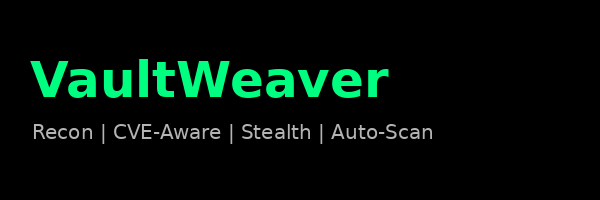

<p align="center">
  
</p>

# VaultWeaver 🔍🧠

VaultWeaver is a hybrid recon + CVE-aware scanning framework built for **precision-targeted bug bounty operations**. It enables a sniper-style approach for identifying vulnerabilities based on:

- Live service fingerprints
- HTTP methods, headers, and authentication flows
- Protocol types (REST, GraphQL, gRPC, SOAP, etc.)
- Endpoint structure and sensitive functionality

This tool follows the principles of the **Vault TechSec CVE-Aware Intelligence Directive**, where CVE templates are not blindly sprayed, but **surgically selected** based on real recon data.

---

## 🚀 Features

- 📡 Passive recon via `httpx`
- 🧠 Smart CVE-aware mode (tag generation based on recon fingerprints)
- 🎯 Dynamic Nuclei scan list building
- 💥 Supports REST, GraphQL, SOAP, gRPC tagging
- 🔐 Focused on authentication, access control, and data exposure flaws

---

## 🛠 Usage

```bash
python3 vaultweaver.py --target target.com --vault-aware
